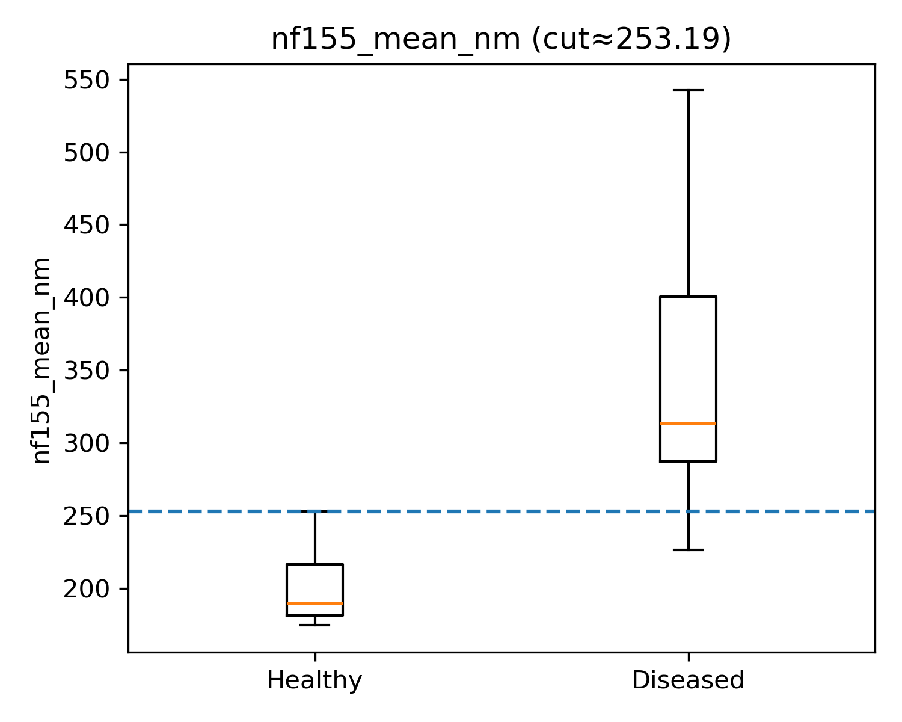

# Diabetic Neuropathy: Paranodal Protein Periodicity Analysis

Super-resolution microscopy reveals paranodal protein disruption as a diagnostic biomarker for diabetic neuropathy.

## Key Findings

| Finding | Result |
|---------|--------|
| **Screening (Control vs Patient)** | AUC = 0.94–0.99 (Excellent) |
| **Best Markers** | NF155, NF186, CASPR1 |
| **Diagnostic Cutoffs** | NF155/NF186 ≥253 nm, CASPR1 ≥278 nm |
| **Specificity** | 100% (no false positives in controls) |
| **Sensitivity** | 86–95% |
| **NF155 ↔ NF186 Correlation** | ρ = 1.00 (redundant—use only one) |
| **Severity Staging** | AUC = 0.72 (modest, underpowered) |

### Main Result

Paranodal protein periodicity measured by super-resolution microscopy distinguishes healthy controls from diabetic patients with near-perfect accuracy. Periodicity increases from ~200 nm in healthy nerve to ~320–370 nm in diabetic patients.



## Dataset

- **Total:** n=37 subjects
- **Control (healthy):** n=14
- **DM+Neuropathy:** n=16
- **DM only (no neuropathy):** n=7

### Measured Variables

| Category | Variables |
|----------|-----------|
| **Microscopy** | NF155, NF186, CASPR1 periodicity (nm) |
| **Clinical** | Age, Sex, Diabetes duration, HbA1c, SNAP, NIS-LL, SAS, NPSI, IENFD |

## Repository Structure
```
├── analysis/
│   ├── diagnostics_nonparametric/    # Main diagnostic analysis
│   ├── effect-relations/             # Effect sizes and correlations
│   ├── feature-analysis/             # Feature importance, SHAP, trees
│   ├── final-healthy-vs-diseased/    # Publication figures
│   ├── group-diagnostics/            # Multi-group comparisons
│   └── micro-predictors/             # Microscopy prediction models
├── data/
│   └── raw_data/                     # Original Excel files
├── documents/                        # Summary reports
└── scripts/                          # Jupyter notebooks
```

## Reproducing the Analysis

### Requirements
```bash
pip install pandas numpy matplotlib seaborn scipy scikit-learn openpyxl
```

### Run
```python
# Load data
import pandas as pd
df = pd.read_excel('data/raw_data/Johannes_Version-2-qc.xlsx')

# See scripts/ for complete analysis notebooks
```

## Data Limitations

| Issue | Impact |
|-------|--------|
| **Controls lack clinical data** | Cannot compare microscopy vs clinical measures |
| **DM-only NPSI all zeros** | Likely unmeasured; pain correlation unreliable |
| **DM-only n=7** | Severity staging underpowered (need n≥20) |
| **Cross-sectional design** | Cannot claim "early detection" |
| **Single center** | Cutoffs require external validation |

## Classification Targets

| Target | Groups | Question | Performance |
|--------|--------|----------|-------------|
| **Screening** | Control vs Patient | Has diabetic nerve pathology? | AUC 0.94–0.99 ✓ |
| **Neuropathy** | Control vs DM+Neuro | Has clinical neuropathy? | AUC 0.98–1.00 ✓ |
| **Severity** | DM+Neuro vs DM-only | How severe? | AUC 0.72 ⚠️ |

## What Can Be Claimed

### ✓ Supported
- Microscopy provides excellent screening for diabetic nerve pathology
- NF155 and NF186 are redundant (ρ=1.00)
- Proposed cutoffs achieve 100% specificity
- ~95% increase in periodicity in patients

### ⚠️ Tentative
- Severity staging with microscopy (underpowered)
- Optimal cutoff values (need validation)

### ✗ Not Supported
- Microscopy alone can assess severity
- Early detection capability (no longitudinal data)
- NPSI correlation in DM-only group

## Methods

- **Microscopy:** Super-resolution imaging of paranodal proteins
- **Statistics:** Mann-Whitney U, Spearman correlation, ROC-AUC
- **Cutoffs:** Youden's J index
- **Confidence Intervals:** Bootstrap (n=2000)

## Citation

*Manuscript in preparation*

## Contact

Johannes Balkenhol  
[GitHub](https://github.com/johannes-balkenhol)

## License

This project is for research purposes. Please contact authors before use.
